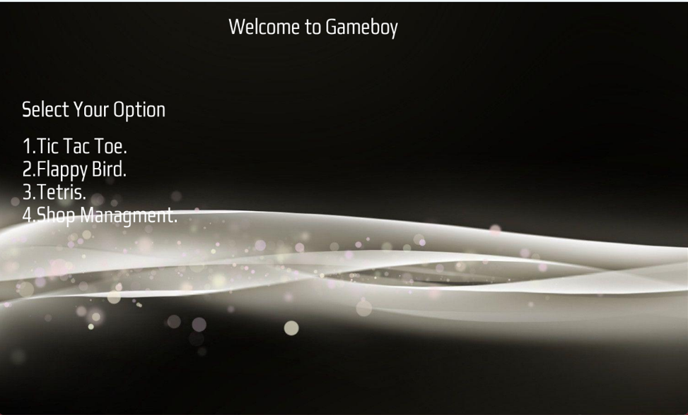
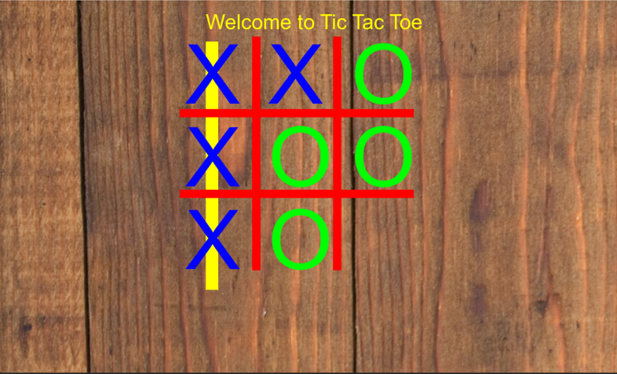
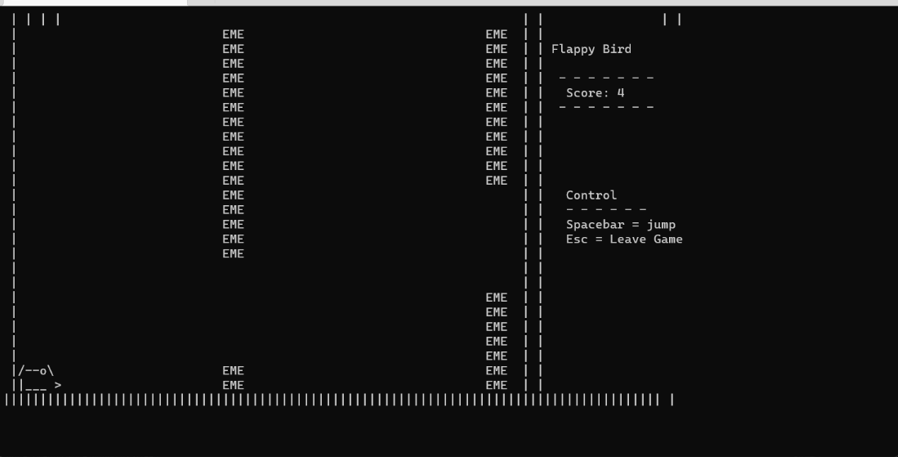
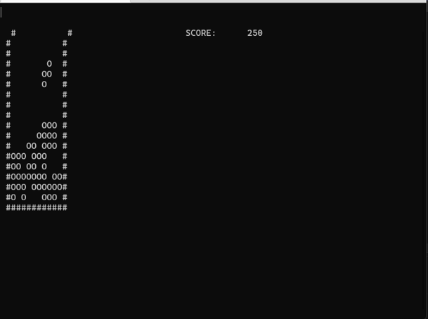
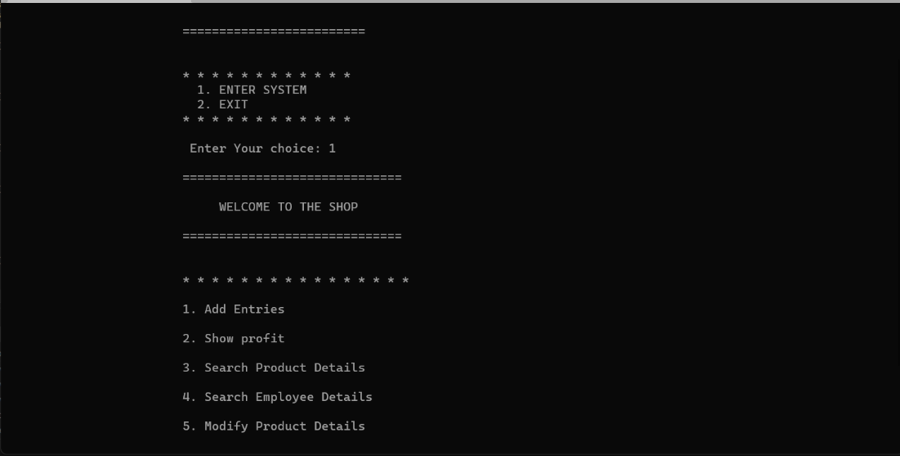

# Gameboy Multi-Game Launcher
-
A C++ multi-game launcher. It bundles four components behind a single graphical menu — **Tic-Tac-Toe**, **Flappy Bird**, **Tetris**, and a console-based **Shop Management System** — mixing **SFML** (for graphics/fonts/menu rendering) with **raw Windows Console Buffer manipulation** (for the ASCII-rendered games) and **file-stream-based persistence with OOP/inheritance** (for the shop management module).

**Stated objective:** *"To write simplest programs in C++."* **Stated introduction (verbatim intent):** the team set out to design code for a device that can handle multiple programs/games — similar in spirit to the late-90s Game Boy — as a single integrated platform so users don't need to switch between devices for different games/utilities, with an eye toward save/load progress and customizable settings. The team's primary technical focus was Flappy Bird, Tic-Tac-Toe, and Tetris, with a management-system module added "to provide the user with extra features."


## Table of Contents

- [Team & Course Context](#team--course-context-from-the-project-report)
- [Overview](#overview)
- [The Game Suite (`Project.cpp`)](#the-game-suite-projectcpp)
  - [Program Flow](#program-flow)
  - [Main Menu](#main-menu)
  - [Game 1: Tic-Tac-Toe (SFML)](#game-1-tic-tac-toe-sfml)
  - [Game 2: Flappy Bird (Console Buffer)](#game-2-flappy-bird-console-buffer)
  - [Game 3: Tetris (Console Buffer)](#game-3-tetris-console-buffer)
  - [Component 4: Shop Management System](#component-4-shop-management-system)
  - [Assets Used by `Project.cpp`](#assets-used-by-projectcpp)
  - [Dependencies](#dependencies)
  - [Building and Running `Project.cpp`](#building-and-running-projectcpp)
- [The Win32 Skeleton (`GUI Application.*`)](#the-win32-skeleton-gui-application)
  - [Architecture](#architecture)
  - [Resources](#resources)
  - [Build System](#build-system)
  - [Building the Win32 Skeleton](#building-the-win32-skeleton)
- [Repository Structure](#repository-structure)
- [File-by-File Reference](#file-by-file-reference)


---

## Overview

| | |
|---|---|
| **Language** | C++ |
| **Real entry point** | `main()` in [`Project.cpp`](Project.cpp) |
| **Graphics** | [SFML](https://www.sfml-dev.org/) (`sf::RenderWindow`, `sf::Sprite`, `sf::Text`, `sf::Font`) for the launcher menu and Tic-Tac-Toe |
| **Text rendering (2 games)** | Native Windows Console API (`SetConsoleCursorPosition`, `WriteConsoleOutputCharacter`, `CreateConsoleScreenBuffer`) for Flappy Bird and Tetris |
| **Platform** | Windows only (uses `<Windows.h>`, `<conio.h>`, console screen buffers, `GetAsyncKeyState`) |
| **Persistence (report version only)** | `<fstream>` file I/O, one flat text file per product/employee record, keyed by ID |
| **Unrelated scaffold present in repo** | A separate, unused Win32 GUI wizard template (`GUI Application.*`) — see [below](#the-win32-skeleton-gui-application) |
| **Team** | Muhammad Taha, Mueed Rauf, Talha Arshad, Muhammad Abdullah — NUST C&SE, DE-44 |

## The Game Suite (`Project.cpp`)

This is the actual "Gameboy Multi-Game Launcher": one `.cpp` file containing an SFML-rendered menu screen and three selectable games, two of which fall back to direct console-buffer rendering for speed.

### Program Flow

```
main()
 ├─ create 1500x900 SFML window "Tic Tac Toe", centered on the primary monitor
 ├─ load font  psfont.otf   → used for the menu text
 ├─ load image bg.jpeg      → used as the menu background sprite
 └─ loop while window is open:
     ├─ draw background + menu text ("Welcome to Gameboy", option list)
     ├─ poll for Num1 → call Tic_Tac_Toe()      (stays inside the same SFML window)
     ├─ poll for Num2 → close SFML window, call Flappy_bird()  (switches to console rendering)
     └─ poll for Num3 → close SFML window, call Tetris()       (switches to console rendering)
```

### Main Menu

Rendered with SFML (`sf::Text` over an `sf::Sprite` background), listing:

```
Welcome to Gameboy
Select Your Option
1. Tic Tac Toe.
2. Flappy Bird.
3. Tetris.
```


Selection is done by **polling `sf::Keyboard::isKeyPressed`** for the number keys `1`/`2`/`3` inside the render loop (not an event-driven `KeyPressed` handler), so a game launches as soon as the corresponding key is held down/pressed while the menu is showing.

### Game 1: Tic-Tac-Toe (SFML)

Implemented in `Tic_Tac_Toe(sf::RenderWindow&, sf::Text&, sf::Texture&, sf::Sprite&, sf::Font&)`.

- **Board**: a 3×3 grid represented by `char Arr[10]` (1-indexed, `Arr[0]` unused), each cell holding `' '` (empty), `'w'` (player/human), or `'p'` (computer).
- **Rendering**: the background is swapped to `R.jpeg`; the grid lines are drawn with `sf::RectangleShape` (`L1`/`L2` for the two straight grid dividers), and glyphs are drawn as large (`characterSize = 200`) SFML text — `"X"` in blue for the human, `"O"` in green for the computer — positioned into one of 9 cells via a `displayCharacter[18]` boolean array (indices `0–8` = human marks, `9–17` = computer marks).
- **Turn logic**: a `counter` variable starting at `3` alternates parity each move:
  - **Even counter** → human's turn: pressing number keys `1`–`9` places an `'X'` in the corresponding cell (if empty), and increments `counter`.
  - **Odd counter** → computer's turn: a random number `1–9` (`rand() % 9 + 1`, reseeded with `srand(time(NULL))` every frame) is used as the cell to place an `'O'` in, retried each frame until a free cell is hit.
- **Win detection**: `win_checker()` checks all 3 rows, 3 columns, and both diagonals for three matching non-empty marks, and draws a colored strike-through line (`sf::RectangleShape`, reused/rotated 45°/135° for the diagonals) across the winning combination.
- **Window title text** is redrawn each frame as `"Welcome to Tic Tac Toe"`.

> Because `counter` starts at an **odd** value (3), the very first move each game actually belongs to the computer's branch (`counter % 2 != 0`), not the human — see [Known Issues](#known-issues--bugs--housekeeping).



### Game 2: Flappy Bird (Console Buffer)

Implemented in `Flappy_bird()` and its helpers (`play`, `instructions`, `drawBorder`, `genPipe`, `updateScore`, `drawBird`, `drawPipe`, `collision`, `gameover`, `eraseBird`, `erasePipe`, `setcursor`, `gotoxy`). Runs entirely in the **console window** using `cout`/`gotoxy`/`SetConsoleCursorPosition` — no SFML involved.

- **Screen model**: a fixed-size text "canvas" (`SCREEN_WIDTH=90`, `SCREEN_HEIGHT=26`, playfield up to `WIN_WIDTH=70`), drawn with a bordered box via `drawBorder()`.
- **Bird**: a 2-row, 6-column ASCII sprite (`char bird[2][6]`) drawn/erased at `birdPos` each tick using `drawBird()`/`eraseBird()` (erase-then-move-then-redraw animation, i.e. manual double-buffering by character overwrite).
- **Controls**: polled via `_kbhit()`/`_getch()` — **Spacebar** makes the bird "jump" (`birdPos -= 4`, clamped so it can't go above row 3); the bird otherwise falls by `+1` every loop iteration (simple constant-gravity model). **Esc** returns to the menu.
- **Pipes**: two pipe slots (`pipePos[]`, `gapPos[]`, `pipeFlag[]`) drawn as columns of `"E M E"` text with a randomized vertical gap (`genPipe()` picks `gapPos = 3 + rand() % 14`, gap height `GAP_SIZE = 7`). A second pipe is spawned once the first crosses `x ≈ 40`, and pipes recycle/scroll via `pipePos[i] += 2` each tick.
- **Collision & scoring**: `collision()` checks whether the bird's row is inside the gap once the first pipe reaches `pipePos[0] >= 61`; passing a pipe (`pipePos[0] > 68`) increments `score` (shown via `updateScore()`).
- **Game over**: hitting a pipe or falling past the bottom border (`birdPos > SCREEN_HEIGHT - 2`) shows a "Game Over" banner and returns to the text menu.
- **Frame pacing**: fixed `Sleep(100)` per tick (~10 FPS).




### Game 3: Tetris (Console Buffer)

Implemented in `Tetris()` plus `rotate()` and `Doesfit()`, using a **dedicated console screen buffer** (`CreateConsoleScreenBuffer` / `SetConsoleActiveScreenBuffer` / `WriteConsoleOutputCharacter`) rather than `cout`, for flicker-free full-screen redraws.

- **Piece definitions**: the 7 standard tetrominoes are each encoded as a 16-character wide string (`wstring gameblock[7]`), representing a 4×4 grid where `'X'` marks a filled cell and `'.'` an empty one.
- **Rotation algorithm**: `rotate(int px, int py, int r)` maps a piece-local `(px, py)` coordinate through one of 4 fixed index-remapping formulas (selected by `r % 4`) to get the rotated index into the 4×4 block string — a classic "rotate by index formula" trick that avoids matrix multiplication while still producing 0°/90°/180°/270° rotations.
- **Playfield**: a heap-allocated `unsigned char* pspace` grid (`spacewidth=12 × spaceheight=18`), where `0` = empty, `9` = wall/border (pre-filled on the left/right/bottom edges), and `1–7` = a locked piece's color/id.
- **Collision checking**: `Doesfit(piece, rotation, posx, posy)` walks the piece's 4×4 cells, rotates each via `rotate()`, and checks in-bounds + `pspace` occupancy before allowing a move/rotation.
- **Input**: polled every tick via `GetAsyncKeyState` for **Right Arrow, Left Arrow, Down Arrow, and `Z`** (move right/left, soft-drop, rotate), with a `brotatehold` flag to prevent a single key-press from spinning the piece every frame.
- **Gravity & locking**: a `speedcounter`/`speed=20` tick-based timer forces the active piece down periodically; when it can no longer fall, its cells are baked into `pspace`, completed rows are detected and shifted down (line clear, `+25` score per cleared column cell), and a new random piece (`rand() % 7`) spawns at the top — game over if the new piece immediately collides.
- **Rendering**: the entire play-field plus a live `"SCORE: %8d"` HUD is composed into a `wchar_t* screen` buffer each frame and blitted in one call via `WriteConsoleOutputCharacter`.
- **Frame pacing**: `this_thread::sleep_for(50ms)` per tick (~20 FPS).



### Component 4: Shop Management System

The Project Report's listing adds a fourth menu option — `"4.Shop Managment."` — wired to a `shop_managment()` function, and credits it to **Muhammad Abdullah**, built with OOP and inheritance. **This function, and everything it depends on, is absent from the [`Project.cpp`](Project.cpp) file currently checked into this repository** — the repo's `main()` only offers options 1–3. It is documented here so the intended full scope of the project is not lost, and so it can be re-integrated (see [Roadmap](#roadmap)).

As described in the report, the module is a small console-based **shop/inventory admin tool**, structured as:

- **Class hierarchy** (multiple/virtual inheritance):
  - `earn` — base class holding a `profit` total; `show()` reads a running profit value out of a flat file (`OOO.txt`) and prints it (prints `"PROFIT = 0"` if the file doesn't exist yet).
  - `product : public virtual earn` — a product record (`quan`, `name`, `id`, `percost`, `persell`, computed `cost`/`sell`); `cal()` computes cost/sell from quantity and updates the shared `profit`; `get()` prompts for `N` products interactively and writes each to `<product-id>.txt`.
  - `staff : public virtual earn` — an employee record (`salary`, `post`, `empid`, `postquan`); `cal()` deducts salary costs from `profit`; `getstaff()` prompts for employee data and writes it to `<employee-id>.txt`.
  - `amount : public staff, public product` — the combined "transaction" class exposing `add()` (routes to either product or employee entry), `update_item()` / `update_emp()` (rewrite an existing record's file after re-prompting for its fields).
- **Persistence model**: no database — every product/employee is its own flat text file named after its ID (`<id>.txt`), read/written with `ifstream`/`ofstream`/`fstream` and C-string `strcpy`/`strcat` for filename building; the running profit total is separately persisted in `ooo.txt`/`OOO.txt`.
- **`admin()`** — a text-menu loop offering: Add Entries, Show Profit, Search Product Details, Search Employee Details, Modify Product Details, Modify Employee Details, Exit. Searching/viewing a record just streams the corresponding `<id>.txt` file's raw contents to `cout` character-by-character.
- **`shop_managment()`** — the outer entry point reached from the main game menu; presents a "WELCOME TO MY SHOP" banner with `1. ENTER SYSTEM` (→ `admin()`) / `2. EXIT`.
- **Known bug already present in the reported code**: `switch (op)` in `flappy_bird()`'s menu (report version) has no `break` statements between `case '1'`/`case '2'`/`case '3'`, so selecting "Start Game" falls through into "Instructions" and then "Quit" once `play()` returns; `amount::update_emp()` never checks whether writing the ID's file succeeded before reading input into `post`; profit/staff-cost math (`cal()`) mixes `+=`/`*=` style adjustments across calls without resetting per-record deltas, so repeated calls compound rather than replace.
- 


### Assets Used by `Project.cpp`

| File | Used by | Purpose |
|---|---|---|
| [`psfont.otf`](psfont.otf) | Main menu, Tic-Tac-Toe UI text | SFML font for all in-window text |
| [`ARIAL.TTF`](ARIAL.TTF) | Tic-Tac-Toe | Loaded (as `"ARIAL.ttf"`) and used as the font for the large `X`/`O` glyphs, **overwriting** the `ARIAL` font object that initially held `psfont.otf` |
| [`bg.jpeg`](bg.jpeg) | Main menu | Menu screen background image |
| [`R.jpeg`](R.jpeg) | Tic-Tac-Toe | Background image swapped in once Tic-Tac-Toe starts |

All four files must be present in the executable's **working directory** at runtime — SFML's `loadFromFile` calls use bare relative filenames with no path resolution or error checking.

### Dependencies

- **[SFML](https://www.sfml-dev.org/)** — specifically the `Graphics` (and transitively `Window`/`System`) modules: `sf::RenderWindow`, `sf::Texture`, `sf::Sprite`, `sf::Font`, `sf::Text`, `sf::Keyboard`, `sf::Event`.
- **Windows SDK** — `<Windows.h>` for console buffer APIs, `GetAsyncKeyState`, `Sleep`.
- **C runtime** — `<conio.h>` (`_getch`, `_getche`, `_kbhit`), `<time.h>` (`rand`/`srand` seeding), `<thread>` (`this_thread::sleep_for`).

No SFML NuGet package, vcpkg manifest, or linker configuration for SFML currently exists anywhere in this repository — `Project.cpp` assumes SFML's headers/libs (and its runtime DLLs, e.g. `sfml-graphics-2.dll`, `sfml-window-2.dll`, `sfml-system-2.dll`) are made available by whatever project/toolchain compiles it.

### Building and Running `Project.cpp`

`Project.cpp` is **not** included in `GUI Application.vcxproj`, so it must be compiled separately. Two common approaches:

**Option A — new Visual Studio project + vcpkg**

```powershell
vcpkg install sfml:x64-windows
```

1. Create a new empty **C++ Console/Windows Application** project in Visual Studio.
2. Add `Project.cpp` as the only source file.
3. Link the vcpkg-provided SFML (`sfml-graphics`, `sfml-window`, `sfml-system`) — vcpkg's MSBuild integration (`vcpkg integrate install`) wires include/lib paths automatically.
4. Copy `ARIAL.TTF`, `psfont.otf`, `bg.jpeg`, `R.jpeg` into the build output directory (next to the produced `.exe`) so `loadFromFile` can find them.
5. Build and run.

**Option B — MinGW / g++ command line**

```bash
g++ Project.cpp -o launcher.exe -I<SFML_include_dir> -L<SFML_lib_dir> ^
    -lsfml-graphics -lsfml-window -lsfml-system -lgdi32
```

Then copy the SFML runtime DLLs and the four asset files above alongside `launcher.exe` before running it.

## The Win32 Skeleton (`GUI Application.*`)

This half of the repository is the **unmodified Visual Studio "Windows Desktop Application" wizard template** — scaffolding for a native Win32 GUI app that contains no game logic and is entirely disconnected from `Project.cpp`. It is documented here for completeness since it is checked into the repo and has its own build configuration.

### Architecture

All logic lives in [`GUI Application.cpp`](GUI%20Application.cpp):

- **`wWinMain`** — Unicode entry point. Loads `szTitle`/`szWindowClass` strings from the resource string table, registers the window class, creates/shows the window, loads the accelerator table, and runs the standard blocking Win32 message loop (`GetMessage` → `TranslateAccelerator`/`TranslateMessage` → `DispatchMessage`).
- **`MyRegisterClass`** — fills and registers a `WNDCLASSEXW` (icon, cursor, background brush, menu, window-proc pointer).
- **`InitInstance`** — stores `hInst`, creates the top-level window (`WS_OVERLAPPEDWINDOW`, default size/position), shows/updates it.
- **`WndProc`** — handles `WM_COMMAND` (`IDM_ABOUT` opens the About dialog, `IDM_EXIT` destroys the window), `WM_PAINT` (empty `BeginPaint`/`EndPaint` stub — no drawing), and `WM_DESTROY` (`PostQuitMessage`).
- **`About`** — modal dialog procedure for the About box; closes on `IDOK`/`IDCANCEL`.

### Resources

Declared in [`GUI Application.rc`](GUI%20Application.rc), IDs defined in [`Resource.h`](Resource.h):

- **Menu** (`IDC_GUIAPPLICATION`): `File → Exit` (`IDM_EXIT`), `Help → About...` (`IDM_ABOUT`).
- **Accelerators**: `Alt+?` and `Alt+/` both map to `IDM_ABOUT`.
- **Dialog** `IDD_ABOUTBOX`: fixed 170×62 DLU modal box showing app name/version, "Copyright (c) 2023", and an OK button.
- **String table**: `IDC_GUIAPPLICATION` = `"GUIAPPLICATION"` (window class name), `IDS_APP_TITLE` = `"GUI Application"` (window title).
- **Icons**: [`GUI Application.ico`](GUI%20Application.ico) (main) and [`small.ico`](small.ico) (taskbar/title-bar).

### Build System

[`GUI Application.vcxproj`](GUI%20Application.vcxproj) — MSBuild project, `PlatformToolset=v143` (VS2022), `CharacterSet=Unicode`, four configurations (`Debug`/`Release` × `Win32`/`x64`), all building a `Windows`-subsystem `.exe` with Level 3 warnings, SDL checks, and conformance mode enabled; Release adds function-level linking, intrinsics, whole-program optimization, COMDAT folding, and reference optimization. No SFML or other third-party references exist in this project file.

### Building the Win32 Skeleton

```powershell
msbuild "GUI Application.vcxproj" /p:Configuration=Release /p:Platform=x64
```

Or open `GUI Application.vcxproj` directly in Visual Studio 2022 and build/run with `Ctrl+Shift+B` / `F5`. Running it just shows an empty window with a `File`/`Help` menu and an About dialog — no games, no content.

## Repository Structure

```
-Gameboy-Multi-Game-Launcher/
├── Project.cpp                     # ⭐ The actual game suite: menu + Tic-Tac-Toe (SFML) + Flappy Bird & Tetris (console buffer)
├── ARIAL.TTF                       # Font asset — large X/O glyphs in Tic-Tac-Toe
├── psfont.otf                      # Font asset — menu / UI text
├── bg.jpeg                         # Image asset — main menu background
├── R.jpeg                          # Image asset — Tic-Tac-Toe background
│
├── GUI Application.cpp             # Unrelated Win32 wizard skeleton: WinMain, WndProc, message loop
├── GUI Application.h               # Minimal app header (pulls in Resource.h)
├── GUI Application.ico             # Main application icon (32-bit, multi-resolution)
├── GUI Application.rc              # Windows resource script (menu, dialog, strings, icons)
├── GUI Application.vcxproj         # MSBuild project file for the Win32 skeleton only
├── GUI Application.vcxproj.filters # Solution Explorer virtual-folder groupings for VS
├── GUI Application.vcxproj.user    # Per-user IDE settings (debugger, etc.) — machine-specific
├── framework.h                     # Precompiled-style umbrella header (windows.h, CRT headers)
├── Resource.h                      # Numeric IDs for every Win32-skeleton resource
├── targetver.h                     # Minimum supported Windows platform (SDKDDKVer.h)
├── small.ico                       # Small (taskbar/title-bar) icon variant
├── RCa25372                        # Stray temporary file left behind by the RC compiler (see Known Issues)
└── README.md                       # This file
```

## File-by-File Reference

| File | Description |
|---|---|
| [`Project.cpp`](Project.cpp) | The real multi-game launcher: `main()`, menu, `Tic_Tac_Toe`, `win_checker`, the full Flappy Bird module, and the full Tetris module (see [above](#the-game-suite-projectcpp)). Does **not** include the Shop Management System from the Project Report. |
| [`ARIAL.TTF`](ARIAL.TTF) | TrueType font asset used for the Tic-Tac-Toe `X`/`O` glyphs. |
| [`psfont.otf`](psfont.otf) | OpenType font asset used for menu/UI text. |
| [`bg.jpeg`](bg.jpeg) | Menu screen background image. |
| [`R.jpeg`](R.jpeg) | Tic-Tac-Toe screen background image. |
| [`GUI Application.cpp`](GUI%20Application.cpp) | Win32 wizard skeleton logic: `wWinMain`, `MyRegisterClass`, `InitInstance`, `WndProc`, `About`. Unrelated to the games. |
| [`GUI Application.h`](GUI%20Application.h) | Tiny header that just `#include`s `resource.h`. |
| [`framework.h`](framework.h) | Umbrella header: `targetver.h`, `WIN32_LEAN_AND_MEAN`, `<windows.h>`, core CRT headers. |
| [`targetver.h`](targetver.h) | Includes `<SDKDDKVer.h>` to target the highest available Windows platform. |
| [`Resource.h`](Resource.h) | Auto-generated numeric resource IDs for the Win32 skeleton (menu items, dialog, icons). Normally regenerated by the VS Resource Editor. |
| [`GUI Application.rc`](GUI%20Application.rc) | Windows resource script: icons, menu, accelerator table, About dialog, string table for the Win32 skeleton. |
| [`GUI Application.ico`](GUI%20Application.ico) / [`small.ico`](small.ico) | Multi-resolution icon files for the Win32 skeleton's window/taskbar icon. |
| [`GUI Application.vcxproj`](GUI%20Application.vcxproj) | MSBuild project file for the Win32 skeleton only — does **not** build `Project.cpp`. |
| [`GUI Application.vcxproj.filters`](GUI%20Application.vcxproj.filters) | Cosmetic Solution Explorer virtual-folder groupings; doesn't affect the build. |
| [`GUI Application.vcxproj.user`](GUI%20Application.vcxproj.user) | Per-developer, machine-local IDE settings; not meaningful across checkouts. |
| `RCa25372` | Stray leftover temporary file from the RC (resource) compiler — see [Known Issues](#known-issues--bugs--housekeeping). |
| [`README.md`](README.md) | This documentation file. |
